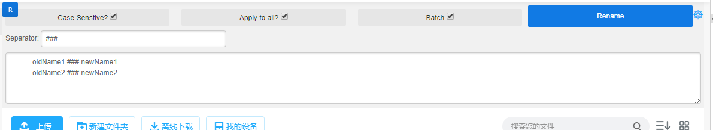

---
title:
  Greasemonkey script for renaming file names on Baidu Netdisk
  百度網盤的重命名小工具
published: false
createdAt: 2020-03-23
imgSrc: greasemonkey-logo.png
catalog: product
---

## Description

A GreaseMonkey script renaming files on web-based version of baidu netdisk

## Usage

1. Install [Tampermonkey](https://www.tampermonkey.net/)
1. Install
   [this script](https://greasyfork.org/en/scripts/398489-baidu-netdisk-rename)
1. Open pan.baidu.com/disk
1. A renaming tool will show on the top of file list
1. Input what you want to search and replace
1. Click `Rename` button

### Screen shots

