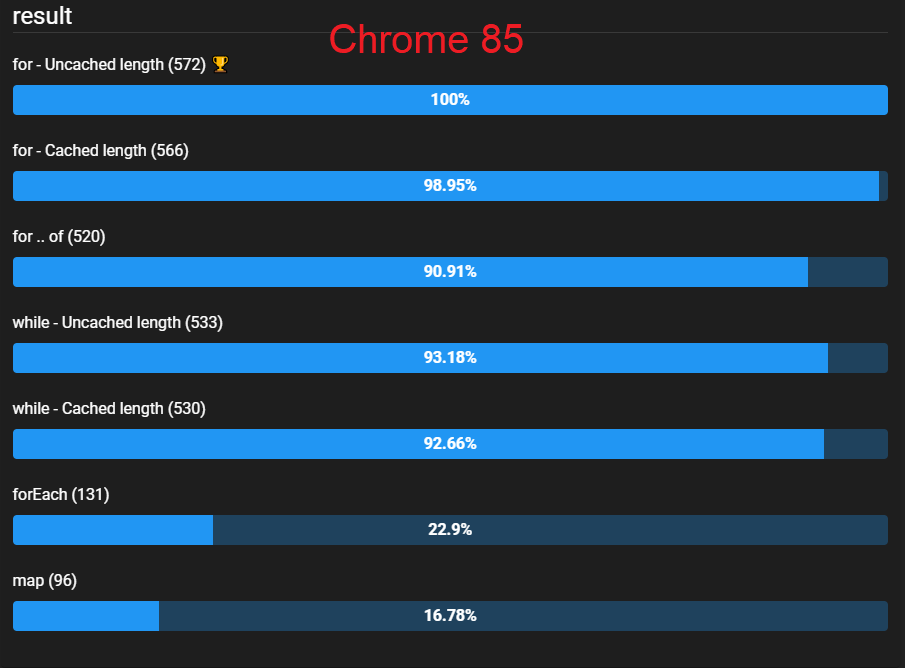
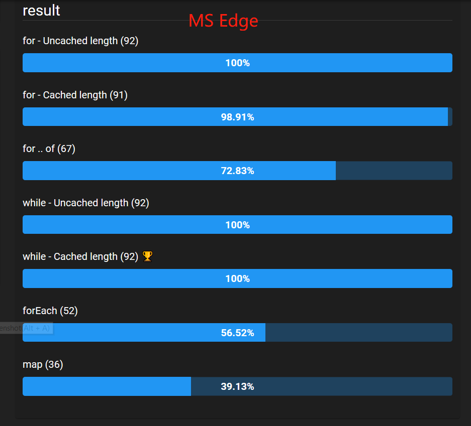
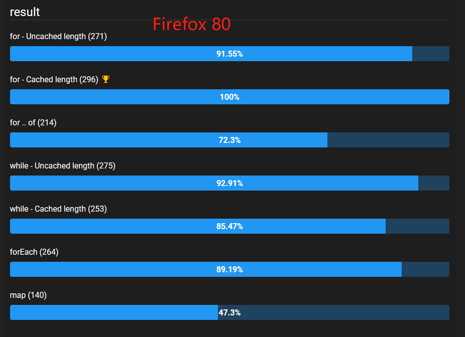

## Benchmark

[https://jsben.ch/EAlKw](https://jsben.ch/EAlKw)

## Result







## Codes

### Execute before every test

```js
var arr = Array(1000000).fill(null)
var dosmth
```

### `for` - Uncached length

```js
for (let i = 0; i < arr.length; i++) {
  dosmth = arr[i]
}
```

### `for` - Cached length

```js
let len = arr.length
for (let i = 0; i < len; i++) {
  dosmth = arr[i]
}
```

### `for.. of`

```js
for (let val of arr) {
  dosmth = val
}
```

### `while` - Uncached length

```js
let i = 0

while (i < arr.length) {
  dosmth = arr[i]
  ++i
}
```

### `while` - Cached length

```js
let i = 0
const len = arr.length

while (i < len) {
  dosmth = arr[i]
  ++i
}
```

### `forEach`

```js
arr.forEach(el => (dosmth = el))
```

### `map`

```js
arr.map(el => (dosmth = el))
```
