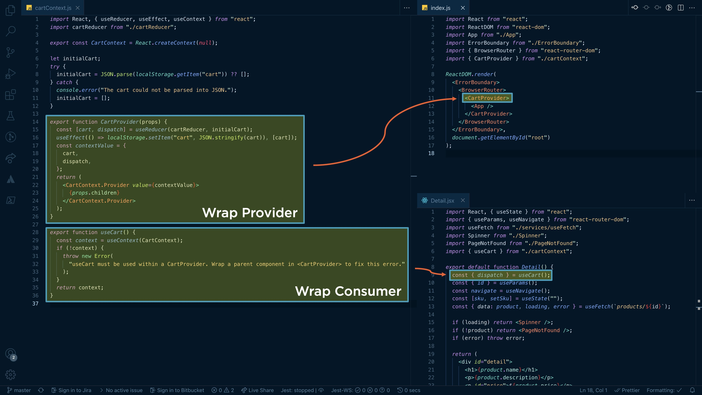

by [@housecor](https://x.com/housecor/status/1437765667906854915?s=20)

## 1. Eight Ways to Handle State in React Apps

| Method            | When to use it                                |
|-------------------|-----------------------------------------------|
| **URL**           | Sharable app location                         |
| **Web storage**   | Persist between sessions, one browser         |
| **Local state**   | Only one component needs the state            |
| **Lifted state**  | A few related components need the state       |
| **Derived state** | State can be derived from existing state      |
| **Refs**          | DOM reference, state that isn’t rendered      |
| **Context**       | Global or subtree state                       |
| **Third party library** | Global state, Remote state             |


## 2. Why Prefer Function Components?

- Less code
- Simpler mental model
- No `this` keyword
- Hooks
- Functions are the future of React

## 3. Normalize state by deriving on render

Derive state from existing state/props

**Examples**
- Call `.length` on an array in render
- Derive `errorsExist` by checking if the errors array is empty.

**Why derive?**
- Avoids out of sync bugs
- Simplifies code

```javascript
export default function Checkout() {
    const { dispatch } = useCart();
    const [address, setAddress] = useState(emptyAddress);
    const [status, setStatus] = useState(STATUS.IDLE);
    const [saveError, setSaveError] = useState(null);
    const [touched, setTouched] = useState({});

    // Derived state
    const errors = getErrors(address);
    const isValid = Object.keys(errors).length === 0;
}
```

## 4. When Does React Render?

- **State change**
  - Can skip render via: 
    - `shouldComponentUpdate`
    - `React.Memo`

- **Prop change**
  - Can skip render via: 
    - `shouldComponentUpdate`
    - `React.Memo`
    - `PureComponent`

- **Parent renders**
  - Can skip render via: 
    - `shouldComponentUpdate`
    - `React.Memo`
    - `PureComponent`

- **Context change**

## 5. Most state is remote state. Streamline remote state via a custom "useApi" hook, react-query, or swr.

The result? WAY less code.

react-query/swr add:
- ✅Caching
- ✅Invalidates & refetches stale data
- ✅Dedupes requests
- ✅Auto retries
- ✅Refetch on refocus/reconnect

### Inline code
```javascript
import { useState, useEffect } from "react";

export default function App() {
    const [products, setProducts] = useState([]);
    const [loading, setLoading] = useState(true);
    const [error, setError] = useState(null);

    useEffect(() => {
        getProducts()
            .then((resp) => resp.json())
            .then((json) => setProducts(json))
            .catch((err) => {
                console.error(err);
                throw err;
            })
            .finally(() => setLoading(false));
    }, []);

    if (loading) return "Loading...";
    if (error) throw error;
    return //JSX HERE
}
```

### Custom hooks
```javascript
import React from "react";
import useFetch from "./useFetch";

export default function App() {
    const { data: products, loading, error } = useFetch("products");
    if (loading) return "Loading...";
    if (error) throw error;
    return //JSX HERE
}
```

## 6. Start local, then lift. Global is a last resort. Prop drilling is no biggie.

1. Declare state in the component that needs it.
2. Child components need the state? Pass state down via props.
3. Non-child components need it? Lift state to common parent.
4. Passing props getting annoying? Consider context, Redux, etc.

## 7. Wrap each context in a single file.

- ✅Streamlines call sites
- ✅Provides useful error if context is consumed without the provider in a parent.



## 8. You don’t need LoDash, Underscore, Ramda. Embrace immutable JS features.
### Handling Immutable Data in JS
- `Object.assign`
- Spread syntax: `{ ...myObj }`
- Immutable array methods:
  - `.map`
  - `.filter`
  - `.find`
  - `.some`
  - `.every`
  - `.reduce`

## 9. You don’t need a form library. You need a pattern.
### What State Do We Need?

| **State Type**  | **State**      | **Description**                       |
|-----------------|----------------|---------------------------------------|
| Store as **touched** | `touched`     | What fields have been touched?       |
| Store as **status**  | `submitted`   | Has the form been submitted?         |
|                 | `isSubmitting` | Is a form submission in progress?    |
|                 | `isValid`      | Is the form currently valid?         |
| Derive          | `errors`       | What are the errors for each field?  |
|                 | `dirty`        | Has the form changed?                |

## 10. Favor “State Enums” over separate booleans
State Enums are 🔥. With simple state enums, you likely don’t need XState and state charts (though they are nice).

```javascript
// Using separate state to track the form's status: (risk of out-of-sync) 👎
const [submitting, setSubmitting] = useState(false); // Submit in progress
const [submitted, setSubmitted] = useState(false);   // Submitted with errors
const [completed, setCompleted] = useState(false);   // Completed

// Using a single status “enum” instead 👍
const STATUS = {
    IDLE: "IDLE",
    SUBMITTING: "SUBMITTING",
    SUBMITTED: "SUBMITTED",
    COMPLETED: "COMPLETED",
};

const [status, setStatus] = useState(STATUS.IDLE);
```

> XState - Open source Finite State Machine
> **Key benefits over simple state enums:**
> 1. **Enforce state transitions**
>   - Declare how and when your app moves between states
>   - Protects from invalid transitions
> 2. **State charts**
